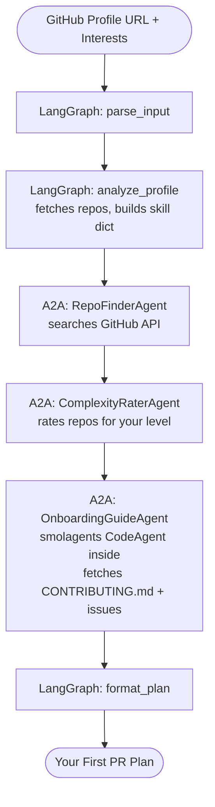

# Beyond the Unpredictable Loop
### Building Production-Grade Agentic Workflows with LangGraph + smolagents + A2A

> Companion repo for the FOSS meetup talk by **Sreejith Surendran** & **Ajmal Nizamudin**
>
> Audience: mixed — students to working professionals. Everything runs free in Google Colab.

---

## The Problem This Demo Solves

Every developer at a FOSS meetup has thought: *"I want to contribute to open source — but where do I start?"*

You can paste a GitHub URL into ChatGPT and get a generic description. That's not interesting. What's interesting is a **multi-agent system** that:

1. Analyses **your** GitHub profile (languages, experience, repos)
2. Discovers repositories that genuinely need contributors with your skills
3. Rates each repo's complexity against your level
4. Generates a personalised, step-by-step **"Your First PR"** plan

No single LLM call can do this — it needs real-time GitHub data, parallel specialist reasoning, and deterministic orchestration. That's the hybrid blueprint.

---

## The Architecture

```
Your GitHub profile URL + interests
          │
          ▼
  LangGraph (macro-manager)
    ├─ parse_input_node       ← deterministic: extract username
    ├─ analyze_profile_node   ← fetches your repos, builds skill profile
    │
    ├─ [A2A] RepoFinderAgent  ← searches GitHub for matching repos
    ├─ [A2A] ComplexityRaterAgent ← rates each repo for your level
    ├─ [A2A] OnboardingGuideAgent ← smolagents CodeAgent inside!
    │          writes Python to fetch CONTRIBUTING.md + open issues
    │
    └─ format_plan_node       ← packages your personalised contribution plan
          │
          ▼
  "Your First PR" personalised plan
```

### Who does what

| Layer | Framework | Responsibility |
|-------|-----------|----------------|
| Orchestration | LangGraph | State graph, routing, ordering of steps |
| Specialist agents | A2A Protocol | Each agent is an independent service with its own Agent Card |
| Code execution | smolagents | OnboardingGuideAgent writes Python to fetch and parse real data |
| LLM | Llama 3.3 70B via Groq | Only used inside smolagents — zero LLM calls in LangGraph routing |

---

## 1. Get Your Free API Keys

### Groq (required — LLM inference)
Free, no credit card, fast Llama 3.3 inference.

1. Go to **[console.groq.com](https://console.groq.com)** → Sign up with Google or GitHub
2. **API Keys** → **Create API Key**
3. You'll paste this into the first setup cell of any notebook

```python
import os, getpass
os.environ["GROQ_API_KEY"] = getpass.getpass("Groq API key: ")
```

### GitHub Personal Access Token (optional but recommended for live demos)
Without a token, the GitHub API allows 60 requests/hour (shared by IP). With a free token: 5,000/hour. If 20 people run the demo at the same meetup, you'll want this.

1. **github.com → Settings → Developer settings → Personal access tokens → Tokens (classic)**
2. Click **Generate new token (classic)** → No scopes needed for public repos → Generate
3. Copy and set in the notebook:

```python
os.environ["GITHUB_TOKEN"] = getpass.getpass("GitHub token (optional): ")
```

---

## 2. Study Path

Work through these in order. Each builds on the last.

| # | Notebook | What you learn | Time | Open in Colab |
|---|----------|----------------|------|---------------|
| 1 | `01_smolagents_basics.ipynb` | CodeAgent, @tool, ToolCallingAgent vs CodeAgent | ~30 min | [](https://colab.research.google.com/github/YOUR_USERNAME/foss_7_2026/blob/main/notebooks/01_smolagents_basics.ipynb) |
| 2 | `02_langgraph_basics.ipynb` | State graphs, conditional routing, human gates | ~30 min | [](https://colab.research.google.com/github/YOUR_USERNAME/foss_7_2026/blob/main/notebooks/02_langgraph_basics.ipynb) |
| 3 | `03_a2a_and_hybrid.ipynb` | A2A protocol, specialist agents, full Matchmaker pipeline | ~45 min | [](https://colab.research.google.com/github/YOUR_USERNAME/foss_7_2026/blob/main/notebooks/03_a2a_and_hybrid.ipynb) |
| Demo | `foss_demo.ipynb` | Live: FOSS Contribution Matchmaker | ~20 min | [](https://colab.research.google.com/github/YOUR_USERNAME/foss_7_2026/blob/main/notebooks/foss_demo.ipynb) |

> Replace `YOUR_USERNAME` with your GitHub username after pushing this repo.

---

## 3. Live Demo — FOSS Contribution Matchmaker

**What the audience does:**
1. Open `foss_demo.ipynb` in Colab
2. Paste Groq API key → run setup
3. Enter their GitHub profile URL + interests (e.g. "web frameworks, APIs")
4. Watch 3 A2A agents analyse and match in real time
5. Get a personalised **"Your First PR"** plan for 2 repos

**What makes it compelling vs. "just ask ChatGPT":**
- Uses **your actual GitHub history** to build a skill profile
- Queries **live GitHub data** (not LLM knowledge, which is stale)
- **3 specialist agents** each do one job well — not one generalist doing everything badly
- **A2A protocol** means each agent could run as an independent service in production
- **smolagents CodeAgent** inside `OnboardingGuideAgent` writes Python live — the audience sees it happen

---

## 4. What is A2A?

**A2A (Agent-to-Agent)** is Google's open protocol (April 2025) for agent interoperability. Each agent:

- Publishes an **Agent Card** at `/.well-known/agent.json` — a JSON manifest of its capabilities
- Accepts **Tasks** via HTTP POST — structured messages with input + context
- Returns **Artifacts** — structured output the orchestrator can parse

Think of it as **microservices for AI agents** — any orchestrator can discover and call any A2A agent without knowing its implementation. This is what makes the ecosystem composable and FOSS-friendly.

```json
{
  "name": "RepoFinderAgent",
  "description": "Discovers GitHub repos matching a developer skill profile",
  "version": "1.0.0",
  "skills": [{
    "id": "find_matching_repos",
    "name": "Find Matching Repositories",
    "description": "Search GitHub for repos with good-first-issues matching given skills",
    "input_modes": ["text"],
    "output_modes": ["data"]
  }]
}
```

In this demo: agents run in-process (same Colab runtime). In production: each would be a separate FastAPI service. The interface is identical either way.

---

## 5. Key Concepts at a Glance

| Term | What it means |
|------|---------------|
| `CodeAgent` | smolagents agent that writes Python code as its action (not JSON) |
| `@tool` | Turns any typed Python function into an agent tool — docstring = prompt schema |
| AST sandbox | smolagents' built-in safety check — blocks dangerous OS calls before running |
| State graph | LangGraph's directed graph — each node is a Python function, edges are routes |
| Human gate | LangGraph `interrupt_before` — pauses for human approval before continuing |
| Agent Card | A2A JSON manifest describing an agent's name, version, and skills |
| A2A Task | Unit of work: message + context → artifacts (output) |

---

## 6. Architecture Diagram



---

## Repo Structure

```
foss_7_2026/
├── README.md
├── Beyond_the_Unpredictable_Loop.pptx
├── slides_export/
│   └── slide_notes.md
└── notebooks/
    ├── 01_smolagents_basics.ipynb       ← study: smolagents fundamentals
    ├── 02_langgraph_basics.ipynb        ← study: LangGraph fundamentals
    ├── 03_a2a_and_hybrid.ipynb          ← study: A2A protocol + full pipeline
    └── foss_demo.ipynb                  ← live audience demo
```
