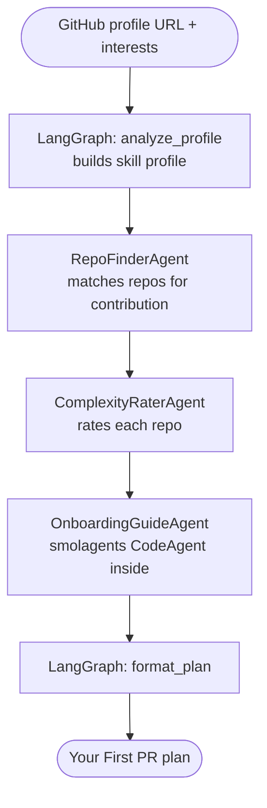
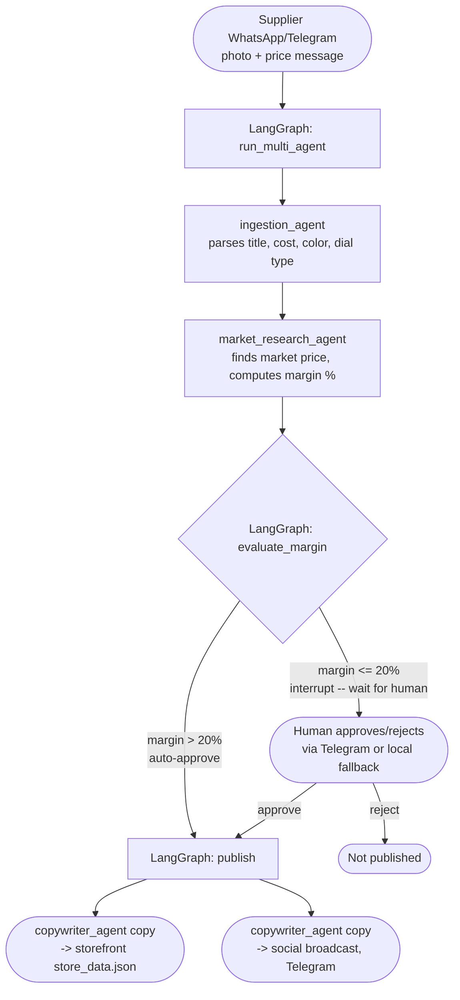

# Beyond the Unpredictable Loop
### Building Production-Grade Agentic Workflows with LangGraph + smolagents

> Companion repo for the FOSS meetup talk by **Sreejith Surendran** & **Ajmal Nizamudin**
>
> Everything runs free in Google Colab.

---

## Repo Structure

```
foss_7_2026/
├── README.md
├── CLAUDE.md
├── slides_export/
│   └── slide_notes.md               ← slide-by-slide reference notes for the talk
├── study_notebooks/                 ← work through 01 → 03 in order, then run the demo
│   ├── 01_smolagents_basics.ipynb
│   ├── 02_langgraph_basics.ipynb
│   ├── 03_a2a_basics.ipynb
│   └── FOSS Matchmaker.ipynb        ← MAIN DEMO 1: live audience demo
└── watch-dropship-demo/             ← MAIN DEMO 2: standalone second demo, own README
    ├── demo.ipynb                   ← stage presentation notebook
    ├── multi_agent_system.py        ← the 3 smolagents + manager
    ├── workflow.py                  ← LangGraph approval-gate StateGraph
    ├── telegram_bot.py              ← Telegram HITL approval + local fallback
    ├── app.py                       ← Flask storefront
    ├── templates/ · static/         ← storefront UI
    └── store_data.json              ← catalog "database"
```

There are **two independent demos** in this repo — they share nothing at runtime beyond the same
`load_key()` API-key convention and Groq/LiteLLM model choice:

| Demo | Where | One-line pitch |
|---|---|---|
| **FOSS Contribution Matchmaker** | `study_notebooks/FOSS Matchmaker.ipynb` | Paste a GitHub profile → get a personalised "Your First PR" plan |
| **Watch Dropshipping Pipeline** | `watch-dropship-demo/` | Supplier message → priced, copywritten listing → human-approval gate → live storefront |

---

## 1. Get Your Free API Keys

### Groq (required — LLM inference)
Free, no credit card, fast Llama 3.3 inference.

1. Go to **[console.groq.com](https://console.groq.com)** → Sign up with Google or GitHub
2. **API Keys** → **Create API Key**
3. You'll paste this into the first setup cell of any notebook

```python
import os, getpass
os.environ["GROQ_API_KEY"] = getpass.getpass("Groq API key: ")
```

### GitHub Personal Access Token (optional — FOSS Matchmaker only)
Without a token, the GitHub API allows 60 requests/hour (shared by IP). With a free token: 5,000/hour. If 20 people run the demo at the same meetup, you'll want this.

1. **github.com → Settings → Developer settings → Personal access tokens → Tokens (classic)**
2. Click **Generate new token (classic)** → No scopes needed for public repos → Generate
3. Copy and set in the notebook:

```python
os.environ["GITHUB_TOKEN"] = getpass.getpass("GitHub token (optional): ")
```

---

## 2. Study Path (`study_notebooks/`)

Work through these in order — each builds on the last, then lands in the FOSS Matchmaker demo.

| # | Notebook | Covers in one line | Time |
|---|----------|---------------------|------|
| 1 | `01_smolagents_basics.ipynb` | `CodeAgent` vs `ToolCallingAgent`, the `@tool` decorator | ~30 min |
| 2 | `02_langgraph_basics.ipynb` | `StateGraph`, conditional routing, human-in-the-loop gates | ~30 min |
| 3 | `03_a2a_basics.ipynb` | A2A protocol + the 3 specialist agents, defined standalone (no LangGraph wiring yet) | ~30 min |

---

## 3. Main Demo 1 — FOSS Contribution Matchmaker

`study_notebooks/FOSS Matchmaker.ipynb` — paste a GitHub profile URL + interests, get a personalised **"Your First PR"** plan. LangGraph orchestrates; each node either does plain Python or calls a specialist agent; one of those agents wraps a smolagents `CodeAgent`.



| Agent | What it does |
|---|---|
| `RepoFinderAgent` | Searches GitHub for repos matching your skill profile + experience level |
| `ComplexityRaterAgent` | Rates each candidate repo beginner / intermediate / advanced (deterministic, no LLM) |
| `OnboardingGuideAgent` | The one LLM-touching agent — wraps a smolagents `CodeAgent` to summarise `CONTRIBUTING.md` + starter issues |

**Run it:** setup cell loads `GROQ_API_KEY` (+ optional `GITHUB_TOKEN`) → paste a GitHub URL + interests → `matchmaker.invoke(...)` streams through the 5 nodes above, printing each agent's live trace → final cell prints the formatted plan.

---

## 4. Main Demo 2 — Watch Dropshipping Multi-Agent Pipeline (`watch-dropship-demo/`)

**Scenario:** a supplier drops a product photo + price in WhatsApp/Telegram. The pipeline turns that
into a priced, copywritten listing — but only publishes it on its own if the deal is clearly good;
otherwise a human has to say yes. LangGraph owns that decision; smolagents does the drafting work.
Full details in [`watch-dropship-demo/README.md`](watch-dropship-demo/README.md).



| Agent | What it does |
|---|---|
| `ingestion_agent` | Sanitizes the raw supplier message into structured specs (title, cost, color, dial type) |
| `market_research_agent` | Finds a comparable market price and computes margin % |
| `copywriter_agent` | Writes the listing copy — published to the storefront JSON and broadcast to social/Telegram once approved |
| `manager_agent` | Orchestrates the 3 agents above via smolagents' `managed_agents=[...]` |

**The human-in-the-loop gate (`evaluate_margin` in `workflow.py`):** margin **> 20%** auto-approves
straight through; margin **≤ 20%** is the risky/thin-margin case, so LangGraph calls `interrupt()`
and pauses the graph until a human taps Approve/Reject on Telegram (or the local fallback cell) —
then `Command(resume=...)` continues the same run from where it paused.

**Run it:** setup cell loads `GROQ_API_KEY` (+ optional Telegram credentials) → Flask storefront
starts in a background thread → a mock supplier signal runs through the graph to the margin gate →
approve on Telegram or locally → storefront + social broadcast update → final cell recaps the run
in one table.

---

## 5. Key Concepts at a Glance

| Term | What it means |
|------|---------------|
| `CodeAgent` | smolagents agent that writes Python code as its action (not JSON) |
| `@tool` | Turns any typed Python function into an agent tool — docstring = prompt schema |
| `managed_agents` | smolagents API for sub-agent orchestration — pass a list of named/described agents to a manager `CodeAgent` |
| State graph | LangGraph's directed graph — each node is a Python function, edges are routes |
| Human gate | LangGraph `interrupt()` — pauses the graph and waits for a human decision before continuing |
